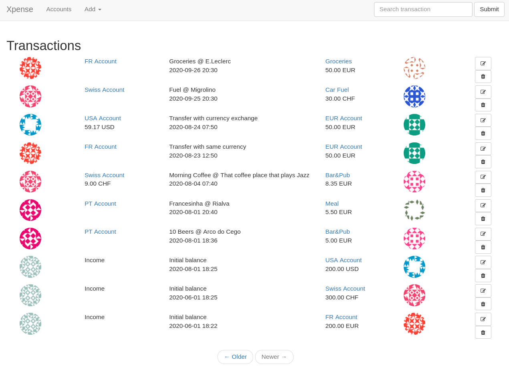

# xpense
Expense tracker




Personal project for learning [flask].
Most of the structure is heavily based on [The Flask Mega-Tutorial]

## Quickstart

Create a Python virtual environment and install the dependencies in `requirements.txt`
```bash
# Create and activate venv
python -m pip install --upgrade pip
pip install -r requirements.txt
```

Upgrade database, import some transactions from example and run server
```bash
flask db upgrade
python import.py
flask run
```


[flask]: https://flask.palletsprojects.com/en/1.1.x/
[The Flask Mega-Tutorial]: https://blog.miguelgrinberg.com/post/the-flask-mega-tutorial-part-i-hello-world
